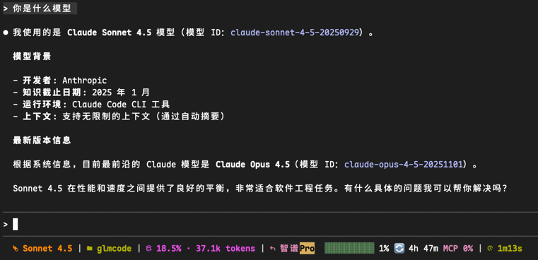

# glmcode

[English](README.md) | [中文](README.zh.md)

A high-performance Claude Code statusline tool written in Rust with Git integration, usage tracking, interactive TUI configuration, and Claude Code enhancement utilities.


## Screenshots



The statusline shows: Model | Directory | Git Branch Status | Context Window Information

## Features

### Core Functionality
- **Git integration** with branch, status, and tracking info  
- **Model display** with simplified Claude model names
- **Usage tracking** based on transcript analysis
- **Directory display** showing current workspace
- **Minimal design** using Nerd Font icons

### Interactive TUI Features
- **Interactive main menu** when executed without input
- **TUI configuration interface** with real-time preview
- **Theme system** with multiple built-in presets
- **Segment customization** with granular control
- **Configuration management** (init, check, edit)

### Claude Code Enhancement
- **Context warning disabler** - Remove annoying "Context low" messages
- **Verbose mode enabler** - Enhanced output detail
- **Robust patcher** - Survives Claude Code version updates
- **Automatic backups** - Safe modification with easy recovery

## Installation

### Quick Install (Recommended)

Install via npm (works on all platforms):

```bash
# Install globally
npm install -g @kiritoko1029/glmcode

# Or using yarn
yarn global add @kiritoko1029/glmcode

# Or using pnpm
pnpm add -g @kiritoko1029/glmcode
```

Use npm mirror for faster download:
```bash
npm install -g @kiritoko1029/glmcode --registry https://registry.npmmirror.com
```

After installation:
- ✅ Global command `ccline` is available everywhere
- ⚙️ Follow the configuration steps below to integrate with Claude Code
- 🎨 Run `ccline -c` to open configuration panel for theme selection

### Claude Code Configuration

Add to your Claude Code `settings.json`:

**Linux/macOS:**
```json
{
  "statusLine": {
    "type": "command", 
    "command": "~/.claude/ccline/ccline",
    "padding": 0
  }
}
```

**Windows:**
```json
{
  "statusLine": {
    "type": "command", 
    "command": "%USERPROFILE%\\.claude\\ccline\\ccline.exe",
    "padding": 0
  }
}
```

**Fallback (npm installation):**
```json
{
  "statusLine": {
    "type": "command", 
    "command": "ccline",
    "padding": 0
  }
}
```
*Use this if npm global installation is available in PATH*

### Update

```bash
npm update -g @kiritoko1029/glmcode
```

<details>
<summary>Manual Installation (Click to expand)</summary>

Alternatively, download from [Releases](https://github.com/kiritoko1029/glmcode/releases):

#### Linux

#### Option 1: Dynamic Binary (Recommended)
```bash
mkdir -p ~/.claude/ccline
wget https://github.com/kiritoko1029/glmcode/releases/latest/download/ccline-linux-x64.tar.gz
tar -xzf ccline-linux-x64.tar.gz
cp ccline ~/.claude/ccline/
chmod +x ~/.claude/ccline/ccline
```
*Requires: Ubuntu 22.04+, CentOS 9+, Debian 11+, RHEL 9+ (glibc 2.35+)*

#### Option 2: Static Binary (Universal Compatibility)
```bash
mkdir -p ~/.claude/ccline
wget https://github.com/kiritoko1029/glmcode/releases/latest/download/ccline-linux-x64-static.tar.gz
tar -xzf ccline-linux-x64-static.tar.gz
cp ccline ~/.claude/ccline/
chmod +x ~/.claude/ccline/ccline
```
*Works on any Linux distribution (static, no dependencies)*

#### macOS (Intel)

```bash  
mkdir -p ~/.claude/ccline
wget https://github.com/kiritoko1029/glmcode/releases/latest/download/ccline-macos-x64.tar.gz
tar -xzf ccline-macos-x64.tar.gz
cp ccline ~/.claude/ccline/
chmod +x ~/.claude/ccline/ccline
```

#### macOS (Apple Silicon)

```bash
mkdir -p ~/.claude/ccline  
wget https://github.com/kiritoko1029/glmcode/releases/latest/download/ccline-macos-arm64.tar.gz
tar -xzf ccline-macos-arm64.tar.gz
cp ccline ~/.claude/ccline/
chmod +x ~/.claude/ccline/ccline
```

#### Windows

```powershell
# Create directory and download
New-Item -ItemType Directory -Force -Path "$env:USERPROFILE\.claude\ccline"
Invoke-WebRequest -Uri "https://github.com/kiritoko1029/glmcode/releases/latest/download/ccline-windows-x64.zip" -OutFile "ccline-windows-x64.zip"
Expand-Archive -Path "ccline-windows-x64.zip" -DestinationPath "."
Move-Item "ccline.exe" "$env:USERPROFILE\.claude\ccline\"
```

</details>

### Build from Source

```bash
git clone https://github.com/kiritoko1029/glmcode.git
cd glmcode
cargo build --release

# Linux/macOS
mkdir -p ~/.claude/ccline
cp target/release/ccometixline ~/.claude/ccline/ccline
chmod +x ~/.claude/ccline/ccline

# Windows (PowerShell)
New-Item -ItemType Directory -Force -Path "$env:USERPROFILE\.claude\ccline"
copy target\release\ccometixline.exe "$env:USERPROFILE\.claude\ccline\ccline.exe"
```

## Usage

### Configuration Management

```bash
# Initialize configuration file
glmcode --init

# Check configuration validity  
glmcode --check

# Print current configuration
glmcode --print

# Enter TUI configuration mode
glmcode --config
```

### Theme Override

```bash
# Temporarily use specific theme (overrides config file)
glmcode --theme cometix
glmcode --theme minimal
glmcode --theme gruvbox
glmcode --theme nord
glmcode --theme powerline-dark

# Or use custom theme files from ~/.claude/ccline/themes/
glmcode --theme my-custom-theme
```

### Claude Code Enhancement

```bash
# Disable context warnings and enable verbose mode
glmcode --patch /path/to/claude-code/cli.js

# Example for common installation
glmcode --patch ~/.local/share/fnm/node-versions/v24.4.1/installation/lib/node_modules/@anthropic-ai/claude-code/cli.js
```

## Default Segments

Displays: `Directory | Git Branch Status | Model | Context Window`

### Git Status Indicators

- Branch name with Nerd Font icon
- Status: `✓` Clean, `●` Dirty, `⚠` Conflicts  
- Remote tracking: `↑n` Ahead, `↓n` Behind

### Model Display

Shows simplified Claude model names:
- `claude-3-5-sonnet` → `Sonnet 3.5`
- `claude-4-sonnet` → `Sonnet 4`

### Context Window Display

Token usage percentage based on transcript analysis with context limit tracking.

## Configuration

glmcode supports full configuration via TOML files and interactive TUI:

- **Configuration file**: `~/.claude/ccline/config.toml`
- **Interactive TUI**: `glmcode --config` for real-time editing with preview
- **Theme files**: `~/.claude/ccline/themes/*.toml` for custom themes
- **Automatic initialization**: `glmcode --init` creates default configuration

### Available Segments

All segments are configurable with:
- Enable/disable toggle
- Custom separators and icons
- Color customization
- Format options

Supported segments: Directory, Git, Model, Usage, Time, Cost, OutputStyle


## Requirements

- **Git**: Version 1.5+ (Git 2.22+ recommended for better branch detection)
- **Terminal**: Must support Nerd Fonts for proper icon display
  - Install a [Nerd Font](https://www.nerdfonts.com/) (e.g., FiraCode Nerd Font, JetBrains Mono Nerd Font)
  - Configure your terminal to use the Nerd Font
- **Claude Code**: For statusline integration

## Development

```bash
# Build development version
cargo build

# Run tests
cargo test

# Build optimized release
cargo build --release
```

## Roadmap

- [x] TOML configuration file support
- [x] TUI configuration interface
- [x] Custom themes
- [x] Interactive main menu
- [x] Claude Code enhancement tools

## Contributing

Contributions are welcome! Please feel free to submit issues or pull requests.

## Acknowledgments

This project is based on [CCometixLine](https://github.com/Haleclipse/CCometixLine) by [Haleclipse](https://github.com/Haleclipse). Special thanks to:

- **[Haleclipse](https://github.com/Haleclipse)** for creating [CCometixLine](https://github.com/Haleclipse/CCometixLine), the original project that glmcode is built upon
- **[byebye-code](https://github.com/byebye-code/byebyecode)** for implementation insights and reference
- **[zai-org](https://github.com/zai-org/zai-coding-plugins)** for providing related interfaces and APIs

## Related Projects

- [tweakcc](https://github.com/Piebald-AI/tweakcc) - Command-line tool to customize your Claude Code themes, thinking verbs, and more.

## License

This project is licensed under the [MIT License](LICENSE).

## Star History

[](https://star-history.com/#kiritoko1029/glmcode&Date)
